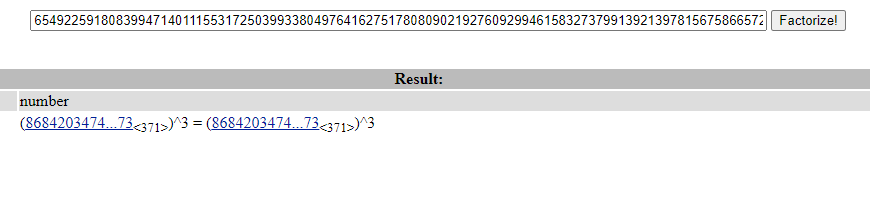

# Last Words

We see some strings. We know this is RSA cipher. 

First I checked the factor of n on factordb:

So now we got the factor, we can use an online tool or a python script. I used an online tool:

and we got the flag.

Flag: RTL{1_c0uld_pr0b4bly_m4k3_th15_al0t_h4rd3r_next_t1m3!!!-e82fac7a780f72579c47b6ce0d5b7fd82eb6192ed65949ca485309b5}
