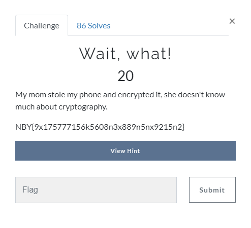
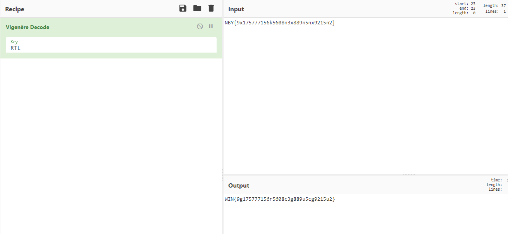
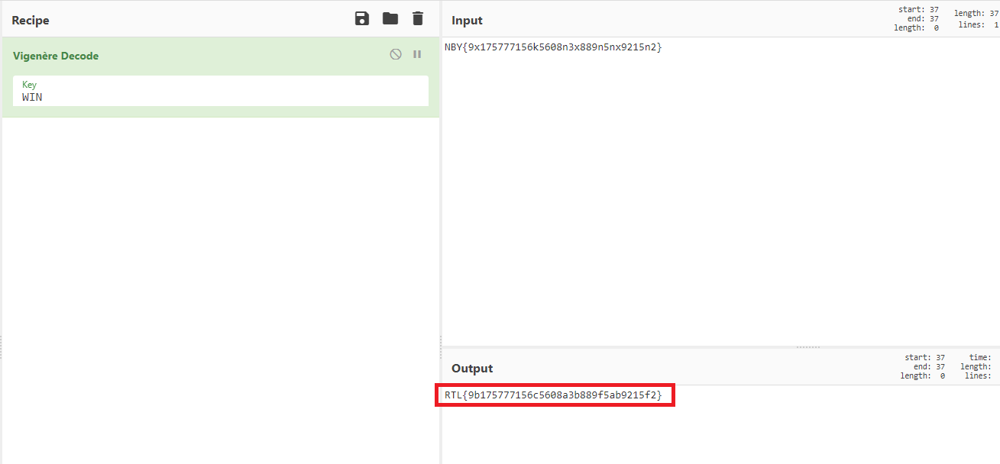

# Wait, what!

So we figured out its vigenère cipher.

First I tried it with the key: RTL, because thats the name of the ctf.

We got:

So now I changed the key to WIN and got the flag:

FLag: RTL{9b175777156c5608a3b889f5ab9215f2}
