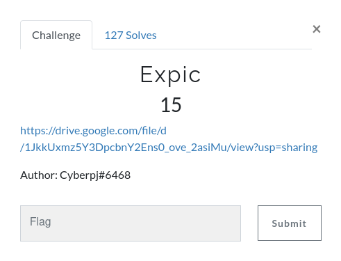
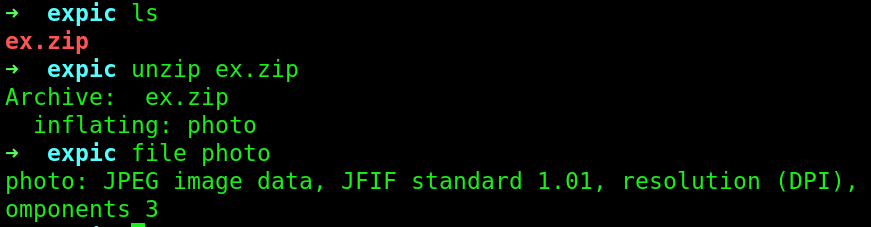
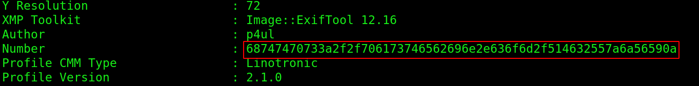
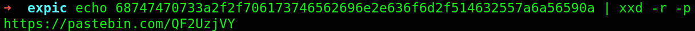
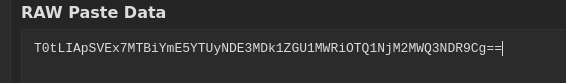
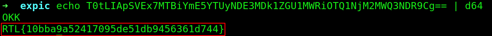

# Expic 

So after downloading the zip file, I unzipped it and checked what kind of file it is:

So I checked the file with exiftool and found a string:

It's an hex string, I decoded it and got a pastebin link:

On the pastebin site we found a base64 string:

After decoding it we got the flag:

Flag: RTL{10bba9a52417095de51db9456361d744}
