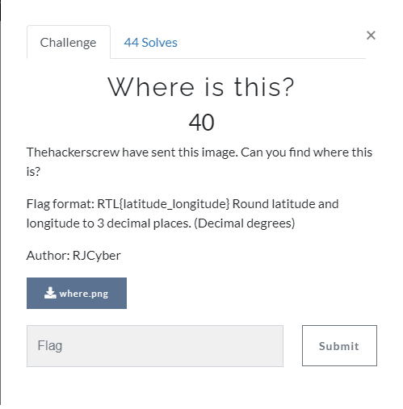
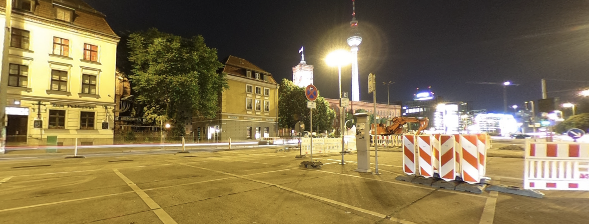
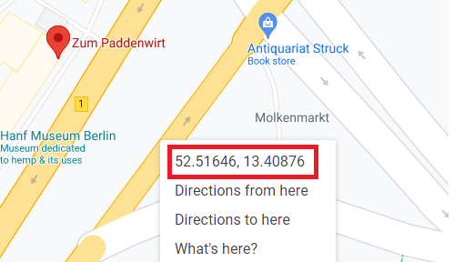

# Where is this?


The Image:



So we can see from the image a shop name:

You need to guess a little bit, but the name is:
```
zum paddenwirt
```
If we then open google maps and search for the exact location we find the longitude and latitude and we got the flag:



So after rounding up:

Flag: RTL{52.517_13.409}
