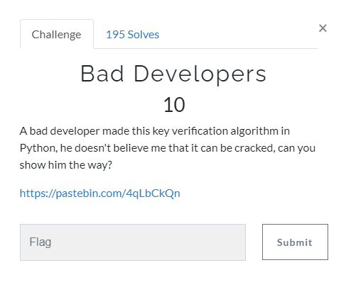
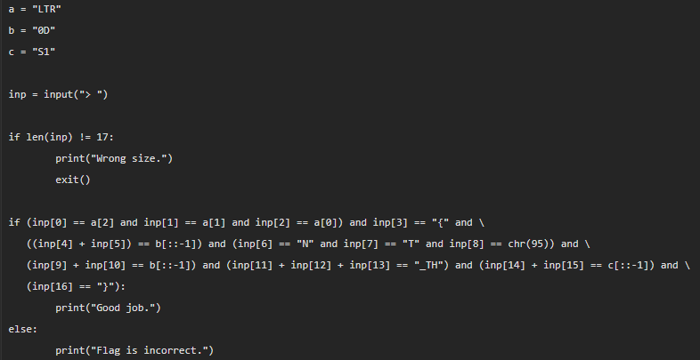

# Bad Developers





So we can see that we can get the flag from the python code.

There are first 3 variables:

```py
a = "LTR"
b = "0D"
c = "S1"
```

The importants part is the if statement:

```py
if (inp[0] == a[2] and inp[1] == a[1] and inp[2] == a[0]) and inp[3] == "{" and \
   ((inp[4] + inp[5]) == b[::-1]) and (inp[6] == "N" and inp[7] == "T" and inp[8] == chr(95)) and \
   (inp[9] + inp[10] == b[::-1]) and (inp[11] + inp[12] + inp[13] == "_TH") and (inp[14] + inp[15] == c[::-1]) and \
   (inp[16] == "}"):
```

First we can see 
```py
inp[0] == a[2] and inp[1] == a[1] and inp[2] == a[0]) and inp[3] == "{"
```
So our first character will be a[2]. a refers to the variable a and [] means the index. The index starts always with 0. 
So like: 'LTR' is '012'. So [2] is R.

So our first charater will be R, second T, third L, fourth { etc....

chr(95) is:

```py
>>> chr(95)
'_'
```

and b[::-1] means:

```py
>>> b = "0D"
>>> print(b[::-1])
D0
```

so after doing everything we get the flag:

Flag: RTL{D0NT_D0_TH1S}

