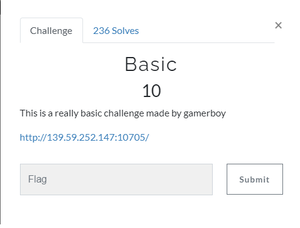
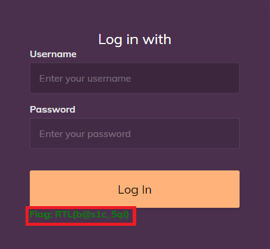

# Basic


This was the only web challenge. If we check the site we see a normal login form:


So I tried sql payloads and after a few tries I got the flag with the payload in the username field:
```
admin`--
```


The flag:
RTL{b@s1c_5ql}
