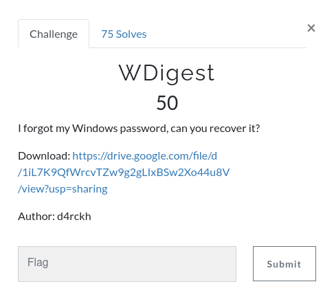
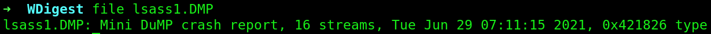
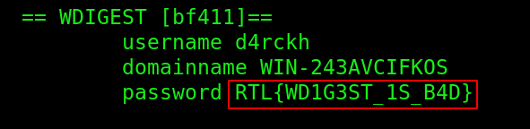

# WDigest



After downloading the file, we can see its an dump file(extensions .dmp):



So after googling about windows dump files, I found this article how to extract information on Linux:

https://technicalnavigator.in/how-to-extract-information-from-dmp-files/

Windows Dump Files are:

```
DMP is a file extension for the dump file format used by Windows to dump the memory of a crashed program into a file for later diagnostic analysis.
```

So after reading the article I installed the program pypykatz:

```bash
pip3 install pypykatz
```

after installing I used this command:

```bash
pypykatz lsa minidump lsass1.DMP
```


and we got a flag!

Flag: RTL{WD1G3ST_1S_B4D}
